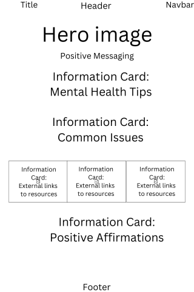

# Personal Project 1 - Jeremy Greig

External User’s Goal: The user seeks accessible, beginner-friendly information on mental health, including how to recognize common issues and manage stress, presented in a supportive and organised layout.

Site Owner’s Goal: The site owner wants to create a welcoming webpage that provides basic mental health information using a clean and supportive design. The focus is on using HTML and CSS with Bootstrap to create a calming and well-organised user experience.

Project Goal: Create a page that acts as a singular support page for Mental Health First Aiders.

## Design Strategy ##

1.0 - Use existing Love Running website, and customise for project
1.1 - Take tweaked Love Running code, and asked Copilot to customise that code to fit the brief of the project. Specifically matching the following:

- Hero Section with Positive Messaging: A Bootstrap Jumbotron with an encouraging message about mental health, using a calming colour scheme and a simple background image.
- Information Cards: Use Bootstrap’s card components to present mental health tips and common issues, providing a visually appealing way to organise content.
- Resource Links: A grid layout for external links to mental health resources styled with Bootstrap buttons to make them stand out.
- Positive Affirmations: Use Bootstrap’s text utilities to include a section with uplifting quotes or messages to encourage users. 

## Features 

In this section, you should go over the different parts of your project, and describe each in a sentence or so. You will need to explain what value each of the features provides for the user, focusing on who this website is for, what it is that they want to achieve and how your project is the best way to help them achieve these things.

### Existing Features

- __Navigation Bar__

  - Featured on the single page, the full responsive navigation bar includes links to the Logo, Information, and Resources section.
  - This is a single page website, so the navigation links only link to anchors on the page.
  - This will be responsive, changing to an icon for smaller screensizes, and full text for larger.

- __The landing page image__

  - The landing includes a photograph with text overlay to allow the user to see the page is there to help them. 
  - This section introduces the user to MHFA Support with a relaxing image and text to reassure the user.

- __Supporting You Section__

  - The supporting you section will allow the user to quickly access key information when required. 
  - The user will be able to define Mental Health, remember the Triage acronym of AlGEE, and use key contacts. 

- __Resource Links__

  - This section will allow the user to access additonal resource links for either signposting others, or developing themselves. 
  - This section will be updated with new resources once they have been vetted. 

__Positive Affirmations__

  - This section provides messages to support the user with the motivation
  - Any actual motivation is fictional. This is is a not for profit personal project and thus I do not expect Marvel to sue me.

- __The Footer__ 

  - Currently no footer images as there are no external sites to link to. See future iterations.

For some/all of your features, you may choose to reference the specific project files that implement them.

In addition, you may also use this section to discuss plans for additional features to be implemented in the future:

### Features Left to Implement

  - Build out a social media presence, and link to these in the footer
  - Positive affirmations to become a singular quote that changes on each load of the screen and on a timer to keep them fresh.

## Testing 

In this section, you need to convince the assessor that you have conducted enough testing to legitimately believe that the site works well. Essentially, in this part you will want to go over all of your project’s features and ensure that they all work as intended, with the project providing an easy and straightforward way for the users to achieve their goals.

In addition, you should mention in this section how your project looks and works on different browsers and screen sizes.

You should also mention in this section any interesting bugs or problems you discovered during your testing, even if you haven't addressed them yet.

If this section grows too long, you may want to split it off into a separate file and link to it from here.

### Validator Testing 

- HTML
  - No errors were returned when passing through the official [W3C validator](https://validator.w3.org/nu/?doc=https%3A%2F%2Fcode-institute-org.github.io%2Flove-running-2.0%2Findex.html)
- CSS
  - No errors were found when passing through the official [(Jigsaw) validator](https://jigsaw.w3.org/css-validator/validator?uri=https%3A%2F%2Fvalidator.w3.org%2Fnu%2F%3Fdoc%3Dhttps%253A%252F%252Fcode-institute-org.github.io%252Flove-running-2.0%252Findex.html&profile=css3svg&usermedium=all&warning=1&vextwarning=&lang=en#css)

### Unfixed Bugs

You will need to mention unfixed bugs and why they were not fixed. This section should include shortcomings of the frameworks or technologies used. Although time can be a big variable to consider, paucity of time and difficulty understanding implementation is not a valid reason to leave bugs unfixed. 

## Deployment

This section should describe the process you went through to deploy the project to a hosting platform (e.g. GitHub) 

- The site was deployed to GitHub pages. The steps to deploy are as follows: 
  - In the GitHub repository, navigate to the Settings tab 
  - From the source section drop-down menu, select the Master Branch
  - Once the master branch has been selected, the page will be automatically refreshed with a detailed ribbon display to indicate the successful deployment. 

The live link can be found here - https://code-institute-org.github.io/love-running-2.0/index.html 

Code management:

- As this project is being worked on by one person, all work will happen on the main branch unless it is a bug fix. Bug fixes will use a "bug" branch before being merged back into the main code.
- Code will be edited within gitpod and managed via Github
- Any committed code should be accompanied with a commit message to outline the changes added

## Credits 

In this section you need to reference where you got your content, media and extra help from. It is common practice to use code from other repositories and tutorials, however, it is important to be very specific about these sources to avoid plagiarism. 

You can break the credits section up into Content and Media, depending on what you have included in your project. 

### Content 

- The text for the Home page was taken from Wikipedia Article A
- Instructions on how to implement form validation on the Sign Up page was taken from [Specific YouTube Tutorial](https://www.youtube.com/)
- The icons in the footer were taken from [Font Awesome](https://fontawesome.com/)

### Media

- The photos used on the home and sign up page are from This Open Source site
- The images used for the gallery page were taken from this other open source site

Congratulations on completing your Readme, you have made another big stride in the direction of being a developer! 

## Other General Project Advice

Below you will find a couple of extra tips that may be helpful when completing your project. Remember that each of these projects will become part of your final portfolio so it’s important to allow enough time to showcase your best work! 

- One of the most basic elements of keeping a healthy commit history is with the commit message. When getting started with your project, read through [this article](https://chris.beams.io/posts/git-commit/) by Chris Beams on How to Write  a Git Commit Message 
  - Make sure to keep the messages in the imperative mood 

- When naming the files in your project directory, make sure to consider meaningful naming of files, point to specific names and sections of content.
  - For example, instead of naming an image used ‘image1.png’ consider naming it ‘landing_page_img.png’. This will ensure that there are clear file paths kept. 

- Do some extra research on good and bad coding practices, there are a handful of useful articles to read, consider reviewing the following list when getting started:
  - [Writing Your Best Code](https://learn.shayhowe.com/html-css/writing-your-best-code/)
  - [HTML & CSS Coding Best Practices](https://medium.com/@inceptiondj.info/html-css-coding-best-practice-fadb9870a00f)
  - [Google HTML/CSS Style Guide](https://google.github.io/styleguide/htmlcssguide.html#General)

Getting started with your Portfolio Projects can be daunting, planning your project can make it a lot easier to tackle, take small steps to reach the final outcome and enjoy the process! 